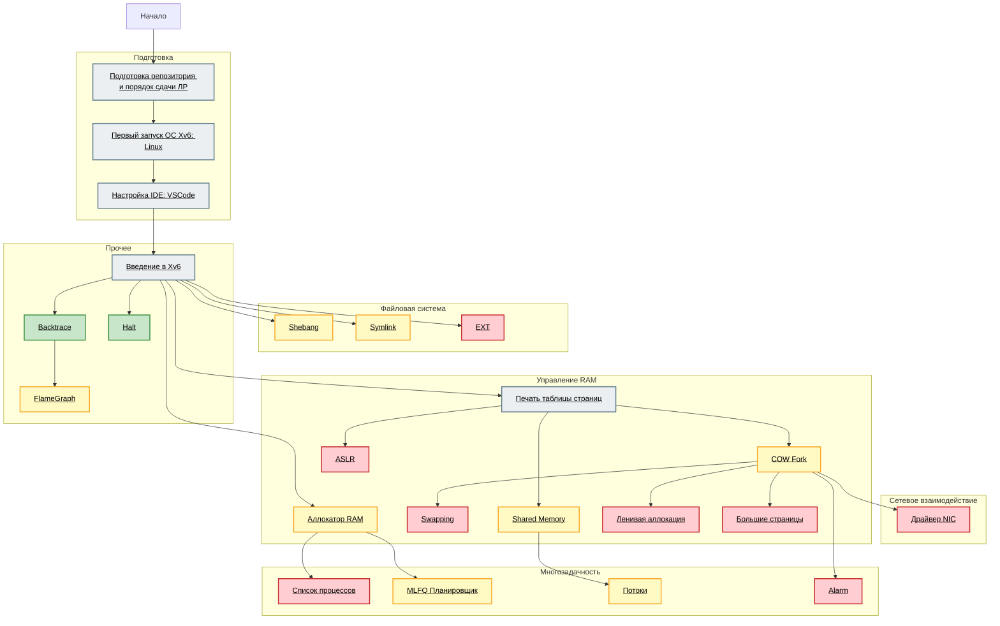

# Форк учебной ОС Xv6 для ITMO CSE

```mermaid
graph TD
    start["Начало"]

    subgraph fs ["Файловая система"]
        shebang["<a href='https://github.com/secs-dev/xv6-riscv/blob/main/doc/lab/shebang.md' style='color:black;'>Shebang</a>"]
        symlink["<a href='https://github.com/secs-dev/xv6-riscv/blob/main/doc/lab/symlink.md' style='color:black;'>Symlink</a>"]
        ext["<a href='https://github.com/secs-dev/xv6-riscv/blob/main/doc/lab/ext.md' style='color:black;'>EXT</a>"]
    end

    subgraph net ["Сетевое взаимодействие"]
        nic["<a href='https://github.com/secs-dev/xv6-riscv/blob/main/doc/lab/nic.md' style='color:black;'>Драйвер NIC</a>"]
    end

    subgraph setup ["Подготовка"]
        repo["<a href='https://github.com/secs-dev/xv6-riscv/blob/main/doc/setup/repo.md' style='color:black;'>Подготовка репозитория и порядок сдачи ЛР</a>"]
        setup_linux["<a href='https://github.com/secs-dev/xv6-riscv/blob/main/doc/setup/linux.md' style='color:black;'>Первый запуск ОС Xv6: Linux</a>"]
        vscode["<a href='https://github.com/secs-dev/xv6-riscv/blob/main/doc/dev/vscode.md' style='color:black;'>Настройка IDE: VSCode</a>"]
    end

    subgraph misc ["Прочее"]
        intro["<a href='https://github.com/secs-dev/xv6-riscv/blob/main/doc/lab/intro.md' style='color:black;'>Введение в Xv6</a>"]
        backtrace["<a href='https://github.com/secs-dev/xv6-riscv/blob/main/doc/lab/backtrace.md' style='color:black;'>Backtrace</a>"]
        halt["<a href='https://github.com/secs-dev/xv6-riscv/blob/main/doc/lab/halt.md' style='color:black;'>Halt</a>"]
        flamegraph["<a href='https://github.com/secs-dev/xv6-riscv/blob/main/doc/lab/flamegraph.md' style='color:black;'>FlameGraph</a>"]
    end

    subgraph mp ["Многозадачность"]
        allocproc["<a href='https://github.com/secs-dev/xv6-riscv/blob/main/doc/lab/allocproc.md' style='color:black;'>Список процессов</a>"]
        mlfq["<a href='https://github.com/secs-dev/xv6-riscv/blob/main/doc/lab/mlfq.md' style='color:black;'>MLFQ Планировщик</a>"]
        thread["<a href='https://github.com/secs-dev/xv6-riscv/blob/main/doc/lab/thread.md' style='color:black;'>Потоки</a>"]
        alarm["<a href='https://github.com/secs-dev/xv6-riscv/blob/main/doc/lab/alarm.md' style='color:black;'>Alarm</a>"]
    end

    subgraph mm ["Управление RAM"]
        filealloc["<a href='https://github.com/secs-dev/xv6-riscv/blob/main/doc/lab/filealloc.md' style='color:black;'>Аллокатор RAM</a>"]
        pteprint["<a href='https://github.com/secs-dev/xv6-riscv/blob/main/doc/lab/printpte.md' style='color:black;'>Печать таблицы страниц</a>"]
        shmem["<a href='https://github.com/secs-dev/xv6-riscv/blob/main/doc/lab/shmem.md' style='color:black;'>Shared Memory</a>"]
        cow["<a href='https://github.com/secs-dev/xv6-riscv/blob/main/doc/lab/cow.md' style='color:black;'>COW Fork</a>"]
        swap["<a href='https://github.com/secs-dev/xv6-riscv/blob/main/doc/lab/swap.md' style='color:black;'>Swapping</a>"]
        lazyalloc["<a href='https://github.com/secs-dev/xv6-riscv/blob/main/doc/lab/lazyalloc.md' style='color:black;'>Ленивая аллокация</a>"]
        hugepage["<a href='https://github.com/secs-dev/xv6-riscv/blob/main/doc/lab/hugepage.md' style='color:black;'>Большие страницы</a>"]
        aslr["<a href='https://github.com/secs-dev/xv6-riscv/blob/main/doc/lab/aslr.md' style='color:black;'>ASLR</a>"]
    end

    start --> repo
    repo --> setup_linux
    setup_linux --> vscode

    cow --> nic

    intro --> shebang
    intro --> symlink
    intro --> ext

    vscode --> intro
    intro --> backtrace
    intro --> halt
    backtrace --> flamegraph

    filealloc --> mlfq
    filealloc --> allocproc
    shmem --> thread
    cow --> alarm

    intro --> filealloc
    intro --> pteprint
    pteprint --> aslr
    pteprint --> shmem
    pteprint --> cow
    cow --> hugepage
    cow --> lazyalloc
    cow --> swap

    ext ~~~ filealloc
    ext ~~~ pteprint
    nic ~~~ cow
    swap ~~~ mlfq
    swap ~~~ allocproc
    hugepage ~~~ thread
    hugepage ~~~ alarm

    classDef free fill:#eceff1,stroke:#607d8b,stroke-width:2px,color:#37474f
    classDef easy fill:#c8e6c9,stroke:#388e3c,stroke-width:2px,color:#1b5e20
    classDef medium fill:#fff9c4,stroke:#f9a825,stroke-width:2px,color:#f57f17
    classDef hard fill:#ffcdd2,stroke:#c62828,stroke-width:2px,color:#b71c1c

    class repo,setup_linux,vscode free

    class intro free
    class backtrace,halt easy
    class flamegraph medium

    class shebang,symlink medium
    class ext hard

    class nic hard

    class thread,mlfq medium
    class alarm,allocproc hard

    class pteprint free
    class filealloc,cow,shmem medium
    class aslr,swap,lazyalloc,hugepage hard
```
